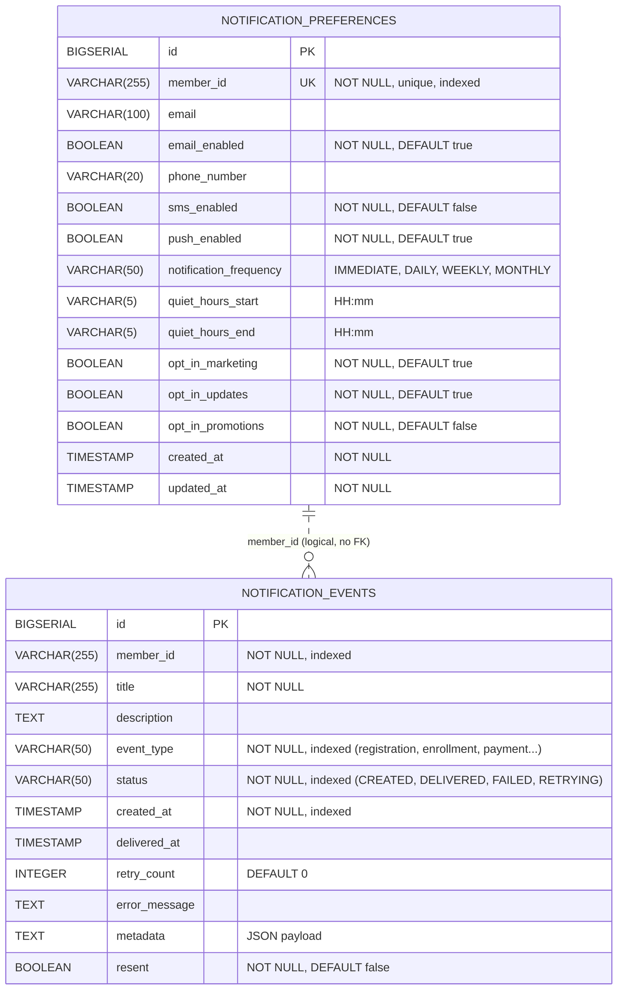

# Notifications Service — ERD

Database schema as of migration `V4__add_resent_column.sql` (active migrations in
`src/main/resources/db/migration_active/`).

There is no physical foreign key between the two tables — they are linked
logically by `member_id`: one `notification_preferences` row per member
(unique constraint), many `notification_events` rows per member.

## Notes

- **`notification_events`** is an immutable audit/event-sourcing table written by the
  Kafka consumer pipeline (`NotificationEvent` entity). Indexes on `member_id`,
  `created_at`, `event_type`, and `status`.
- **`notification_preferences`** holds per-member delivery settings (`NotificationPreference`
  entity), one row per member enforced by the unique constraint on `member_id`.
- The relationship is dashed in the diagram because it is application-level only;
  the database defines no foreign key, and events can exist for members with no
  preference row (defaults are applied in code).
